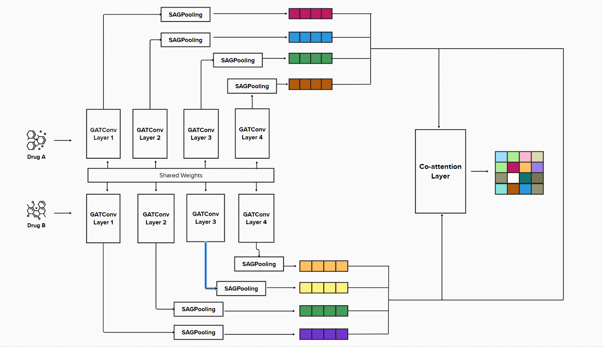

# Internship project

### You can find the dataset and related papers on:

https://www.pnas.org/doi/suppl/10.1073/pnas.1803294115

### Deep research on Deep learning improves prediction of drug–drug and drug–food interactions

The **GAN_DDI model** is a deep learning model for predicting drug-drug interactions. It combines the technologies of graph attention network (GAT) and knowledge graph embedding (KGE) to process the structural information of drugs and the interaction relationship between drugs.

The following is a detailed introduction to each part of the GAN_DDI model:

* **Graph Attention Network (GAT):** The GAN_DDI model uses a graph attention network to process the structural information of drugs. Specifically, it uses multiple GAT layers, each of which contains multiple attention heads. Each attention head will linearly transform the input node features, and then use the attention mechanism to calculate the interrelationships between nodes, and update the features of the nodes according to these relationships. This enables the model to capture the structural properties of the drug molecule.

* **Knowledge Graph Embedding (KGE):** The GAN_DDI model uses knowledge graph embedding to deal with drug interactions. Specifically, it uses the RESCAL model, a knowledge graph embedding model based on matrix factorization. The RESCAL model learns a matrix for each relation, and then uses this matrix to compute the interaction scores for the head and tail nodes. This enables the model to take into account drug-drug interactions.

* **Co-attention mechanism:** The GAN_DDI model uses a co-attention mechanism to model the correlation of two drugs. Specifically, it computes attention scores for each pair of drugs across all relationships, and then uses these scores to weight the interaction score for each relationship. This enables the model to better capture drug-drug interactions.

* **Training and optimization:** The GAN_DDI model uses SigmoidLoss as the loss function, Adam as the optimizer, and LambdaLR as the learning rate scheduler. SigmoidLoss calculates the logarithmic loss for the prediction scores of positive samples and negative samples separately, and then takes the average as the total loss. The Adam optimizer dynamically adjusts the learning rate of each parameter according to the first-order moment and second-order moment of the gradient. The LambdaLR learning rate scheduler adjusts the learning rate according to a preset function, for example in this model it multiplies the learning rate by 0.96 after each epoch.

* **Model structure:** The main body of the GAN_DDI model is a deep neural network, which consists of multiple GAT layers and a KGE layer. Each GAT layer updates the input node features, and then passes the updated features to the next layer. The output features of the last layer will be sent to the KGE layer to calculate the interaction score between drugs.

* **Model output**: The output of the GAN_DDI model is the interaction score of each pair of drugs under all relationships. These scores can be converted into interaction probabilities for predicting drug-drug interactions.

  

 ## Requirements

* Python == 3.7
* [PyTorch](https://pytorch.org/) == 1.6
* [PyTorch Geometry](https://pytorch-geometric.readthedocs.io/) == 2.3.1
* [rdkit](https://www.rdkit.org/) == 2023.03.2

## Environment

You can use Google Colab to run the code. Or you can use your own GPU to run the code.